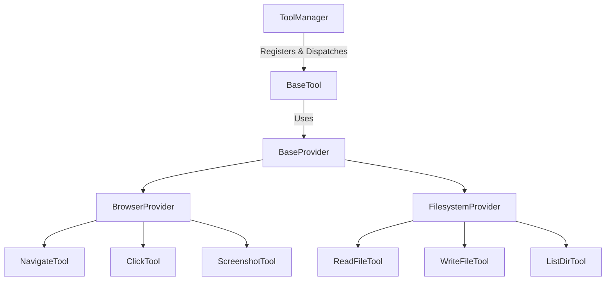

# 🛠️ RaavOne Tools

A high-performance, modular tooling framework and provider ecosystem for **RaavOne Tools**. This package provides core interfaces, execution managers, and native tool implementations for browser, filesystem, and extensible provider-driven automation.

---

## 🎨 UI Refresh Highlights

- Improved layout and section grouping for faster scanning
- Better spacing and cleaner visual hierarchy
- Refined color accents and badge consistency
- Modernized button-style links and callouts
- Stronger typography for headings and body readability

### Quick Actions

[](#-installation)
[](#-quick-start)
[](#-development--testing)

---

## 🏗️ Architecture & Component Design

The framework is structured to decouple tool definitions, execution logic, and external system providers.



### Module Overview

- **`raavone_tools.base`**: Defines base abstractions (`BaseTool`, `BaseProvider`) ensuring consistent interface schemas using Pydantic.
- **`raavone_tools.manager`**: Centralized registry (`ToolManager`) for importing, enabling, validating, and executing tools.
- **`raavone_tools.exceptions`**: Custom exception hierarchy for clean error propagation.
- **`raavone_tools.browser`**: Web interaction provider (driven by Playwright) and browser tools.
- **`raavone_tools.filesystem`**: Safe filesystem utilities constrained to a workspace root.

---

## 🚀 Installation

Install the package in your target environment:

```bash
# Core package (no heavy dependencies)
pip install -e .

# With browser automation support (Playwright)
pip install -e .[browser]
playwright install chromium
```

---

## 💻 Quick Start

### Basic File Operations

```python
from raavone_tools.filesystem.provider import FilesystemProvider
from raavone_tools.filesystem.tool import ReadFileTool
from raavone_tools.manager import ToolManager

# Initialize the manager
manager = ToolManager()

# Initialize provider with workspace boundaries
fs_provider = FilesystemProvider(workspace_root="./sandbox")

# Register filesystem tools
manager.register_tool(ReadFileTool(provider=fs_provider))

# Execute a tool by name with parameters
result = manager.execute("read_file", {"path": "config.json"})
print(result)
```

---

## 🛠️ Development & Testing

Run tests with `pytest`:

```bash
pytest tests/
```

To format and lint the codebase:

```bash
black src/ tests/
isort src/ tests/
mypy src/
```

---

## 📄 License

This project is licensed under the MIT License. See [LICENSE](LICENSE) for details.
